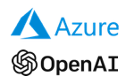
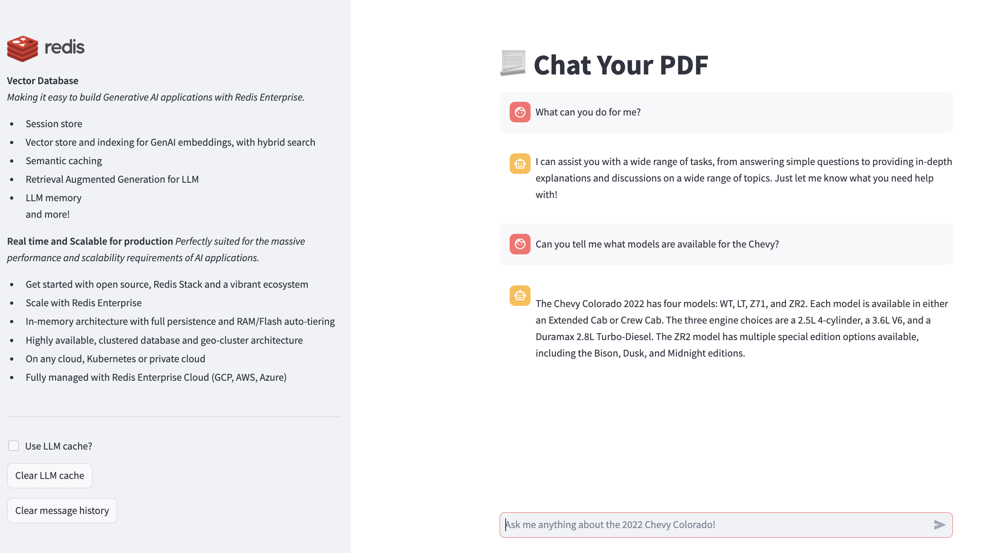
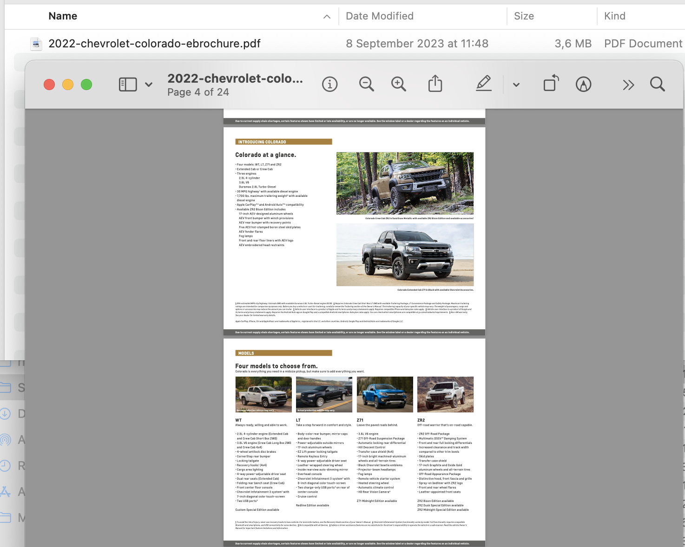
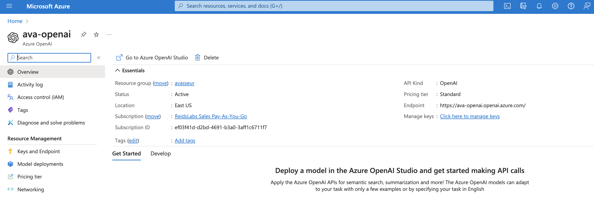
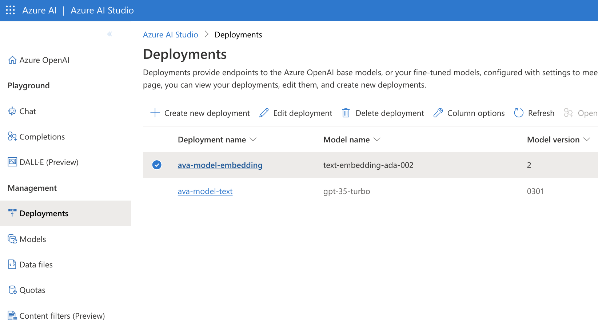
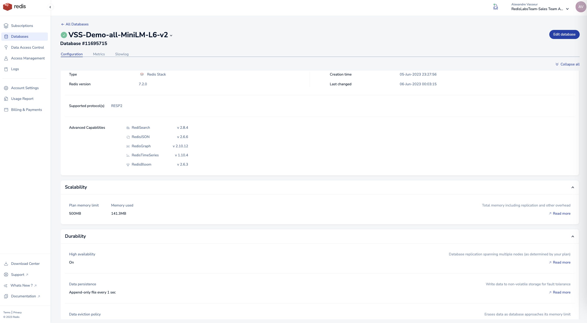
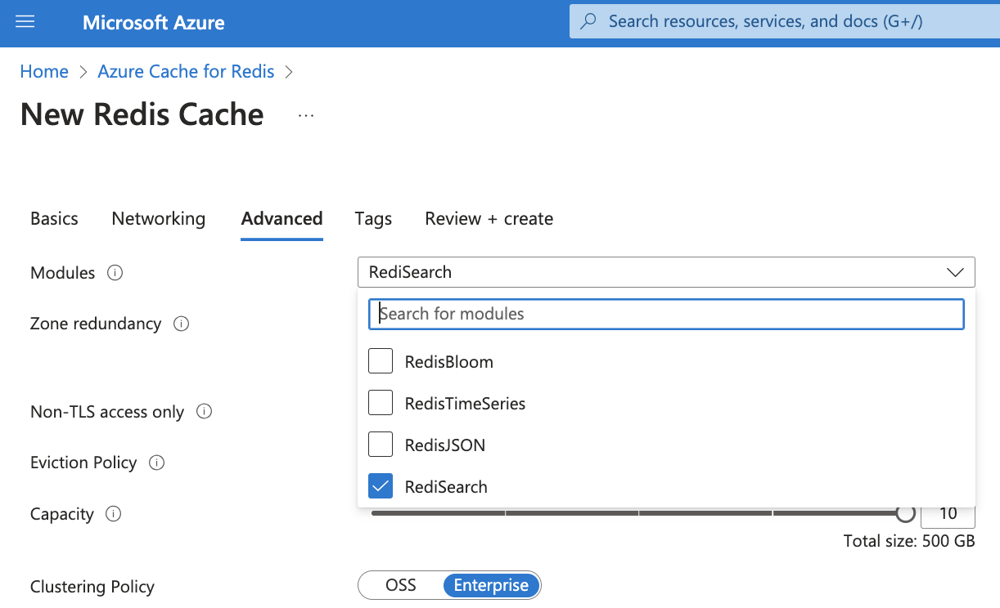
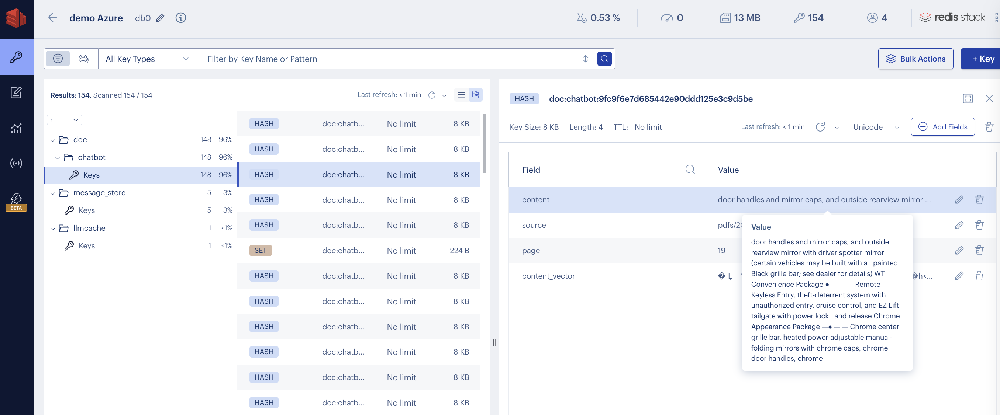

# 📃 Chat Your PDF!

(This project is a variant from https://github.com/RedisVentures/gcp-redis-llm-stack modified to use Azure OpenAI)

This example **Generative AI application** demonstrates how to build a simple chatbot powered by Redis, LangChain, and Azure OpenAI.
It contains the following elements:


- Redis used as **vector database** with **vector similarity search** using Redis Enterprise, Redis Enterprise Cloud, or simple Redis Stack as Docker container.
- It is combined with the Python [RedisVL client](https://redisvl.com) for Retrieval-Augmented Generation (RAG), LLM Semantic Caching, and chat history persistence


- ☁️ [Azure OpenAI](https://azure.microsoft.com/en-us/products/ai-services/openai-service) models for embedding creation and chat completion
- ⚙️ [LangChain](https://python.langchain.com/docs/get_started/introduction.html) for app orchestration, agent construction, and tools
- 🖥️ [Streamlit](https://docs.streamlit.io/knowledge-base/tutorials/build-conversational-apps) for the front end and conversational interface


The resulting application is an interactive chatbot built using vector similarity, GenAI text embeddings and retrieval augmented generation from PDF such as a standard brochure for cars that also keeps semantic caching to optimize LLM costs and improve user experience and context relevance with chat history.





## Key use cases with Redis vector database
Redis is well-versed to power chatbots thanks to its flexible data models, query engine, and high performance. This enables users to leverage Redis for a variety of gen AI needs:
- **RAG** -- ensures that relevant context is retrieved from Redis as a [Vector Database](https://redis.com/solutions/use-cases/vector-database), given a users question
- **Semantic Caching** -- ensures that duplicate requests for identical or very *similar* information are not exhuastive. Ex:
    ```bash
    streamlit    | Full Response Time (secs) 1.6435627937316895
    streamlit    | Cache Response Time (secs) 0.11130380630493164
    ```
- **Chat History** -- ensures distributed & low latency access to conversation history in Redis [Lists](https://redis.io/docs/data-types/lists/)

## Setting up the app environment

### Setup Azure OpenAI models and deployments
You need to setup a deployment for your Azure OpenAI which will give you an OpenAI endpoint and API key, and then deploy models such as for embeddings and for text generation.




### Update LLM environment configuration
The project comes with a template `.env.template` file with the following values. **Make a copy** of this as `.env` file in the same folder. Update the values below accordingly.

*Please note how the variable maps to the deployment your created in Azure OpenAI.*
```bash
OPENAI_API_BASE = "https://ava-openai.openai.azure.com"
OPENAI_API_KEY = "1234567890abcdefghijklmnopqrstuvwxyz"
OPENAI_AZURE_EMBEDDING_DEPLOYMENT = "ava-model-embedding"
OPENAI_AZURE_LLM_DEPLOYMENT = "ava-model-text"

OPENAI_API_TYPE = "azure"
OPENAI_API_VERSION = "2023-05-15"
OPENAI_LOG = "debug"
```

### Setup your Redis database

You can use
- **[Redis Stack](https://redis.io/docs/getting-started/install-stack/)** as a standalone database running locally or as provided in the `docker-compose.yml` with [Redis Insight on port 8001](http://localhost:8001)
- **[Redis Enterprise](https://redis.com/redis-enterprise-software/overview/)** as self-managed clustered on machines, VM, or Kubernetes. Please refer to doc or reach out to us - this is the most feature-complete, enterprise-grade Redis.
- **[Redis Enterprise Cloud](https://redis.com/redis-enterprise-cloud/overview/)** for which you can get a [free trial](https://redis.com/try-free/). Make sure to create a database with Redis Search (or Redis Stack) profile. It's the same as Redis Enterprise but fully managed on your cloud of choice!
- **[Azure Cache for Redis Enterprise](https://redis.com/cloud-partners/microsoft-azure/)**. Make sure to create a database with Redis Search.

Update the `REDIS_URL` based on your deployment
```
# if using the default "docker compose" with Redis Stack running in the "redis" container
REDIS_URL="redis://redis:6379"
# if running with Azure Cache Redis Enterprise
REDIS_URL="redis://:password@yourendpoint.redisenterprise.cache.azure.net:6379"
# if running code locally and running a standalone Redis Stack
REDIS_URL="redis://localhost:6379"
# if running code in docker container but have Redis running on your host machine
REDIS_URL="redis://host.docker.internal:6379"
# if connecting to Redis with TLS
REDIS_URL="rediss://..."
```

Example setup

**Redis Enterprise Cloud**:
Example of a fully persistent Redis database with Redis 7 and Redis Stack profile including Redis Search for vector similarity search.


**Azure Cache for Redis Enterprise**:
Example of a 10 nodes, 500GB capacity with additional HA (total 1TB database) using E100 x 10 and Redis Enterprise clustering policy with Redis Search.



## Run

To run the app, follow these steps:

1. Clone this repository to your local machine.
2. Set up your Azure OpenAI.
3. Set up your Redis vector database.
3. Copy the `.env.template` to `.env` and configure the values as outlined above.
4. Run the app with Docker compose: `docker-compose up`. You may comment out the `redis` container if you not using a local docker setup for your Redis database.
5. Hit your brower at http://localhost:8080/.

## Using Redis Insight

Using Redis Insight you can observe the data model in Redis:
- content and vector embedding from tokenization of the PDFs for retrieval augmented generation with the LLM using Redis vector similarity search
- semantic caching also using vector embedding from the user questions and improving overall performacne and decreasing LLM costs.
- session storage keeping the human & AI chatbot interaction to further enhance auditability and compliance, improve models and prompt engineering as needed, or act as LLM memory.



## Running the app locally without Docker

It can be useful to also run the app locally if you modify the code and want to quickly test it:

```
cd app

# install or upgrade pipenv
python3 -m pip install -U pipenv

# install the dependencies
# pipenv --rm
pip install --user pipenv
pipenv install -r requirements.txt

# run the Streamlit app locally
pipenv shell
streamlit run main.py --server.port 8080 --server.enableXsrfProtection false
```

# Parking lot

## Dependencies analysis

docker exec -it 366fc19d3cfd /bin/bash
pip install pipdeptree
pipdeptree